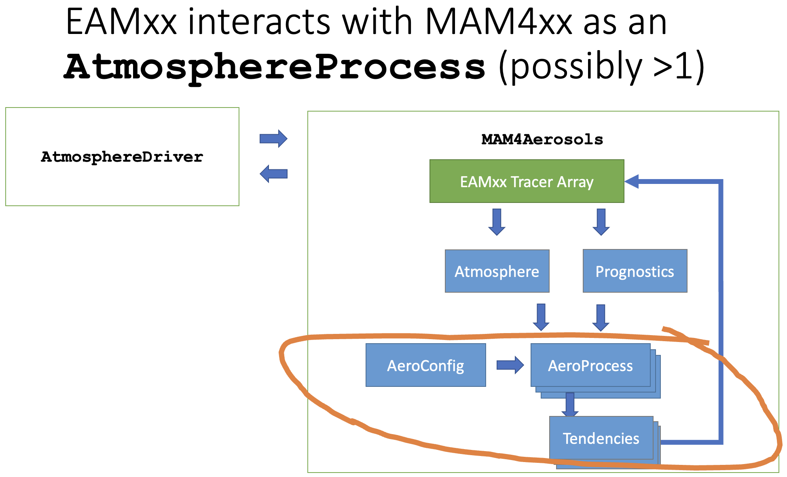
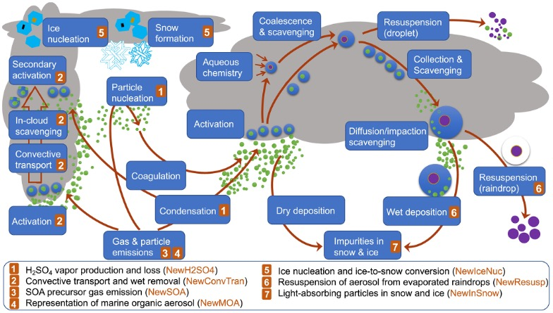

# Developing MAM4xx

Welcome to the MAM4xx development team! MAM4xx is a function-by-function
port of MAM4 (the 4-mode Modal Aerosol Model package) from Fortran to
"performance portable" C++ code that can run on GPU accelerators as well as
traditional CPUs.

This C++ port of MAM4 provides a much-needed prognostic aerosol capability to
the [Energy Exascale Earth System Model (E3SM)](https://e3sm.org), which is
designed to run on the Department of Energy's
[leadership-class computing facilities](https://www.doeleadershipcomputing.org).

## Getting Help

You're part of a team. That means you shouldn't have to sit alone with a problem
and scratch your head until the solution magically appears inside it. If you're
stuck, organize your thoughts and ask another member of the team for their
input. Not only can this save you time, but it can also help you build
productive relationships with other team members.

If you're a member of the MAM4xx development team on the EAGLES Project, the
easiest way to seek help is to post a Slack message to the appropriate channel.
We have access to an `ESMD-BER` Slack workspace with some useful channels for
asynchronous team communication:

* `eagles-mam-cpp`: This is the best channel for discussing and troubleshooting
  issues related to MAM4xx development.
* `eagles_haero`: This channel is for discussing the HAERO aerosol package
  "toolbox" used by MAM4xx.
* `eagles_mamrefactor`: In this channel, you can ask questions about the
  [MAM4 box model](https://github.com/eagles-project/mam_refactor) used for
  porting MAM4's aerosol microphysics parameterizations.

If you're not already on the `ESMD-BER` Slack workspace, please ask a team
member to send you an invitation.

If you like, you can also create issues in the [MAM4xx repository](https://github.com/eagles-project/mam4xx)
itself.

## The Big Picture

MAM4xx makes the 4-mode modal aerosol model ("MAM4") available to
[EAMxx (aka "SCREAM")](https://github.com/E3SM-Project/scream), which is written
in C++ and uses [Kokkos](https://github.com/kokkos/kokkos) to achieve good
parallel performance on platforms of interest to the DOE's Office of Science.
EAMxx has a lot of moving parts, but MAM4xx mainly interacts only with a data
structure called the Atmosphere Driver (AD).

### Terminology

* A **host model** is an atmospheric model containing a dynamical core that
  solves a transport equation for mass in the atmosphere, and several physics
  packages that parameterize important atmospheric processes that can't be
  resolved by the underlying grid. EAMxx is the atmospheric host model used
  by E3SM version 4, so when we refer to the "host model", we refer to EAMxx.
* An **aerosol package** is a physics package that provides a representation of
  aerosols (prognostic and diagnostic variables, and tendencies for evolving
  the prognostics) for use by a host model. The aerosol package of interest for
  us, of course, is MAM4xx.
* An **aerosol process** is a set of functions associated with a specific part
  of the aerosol lifecycle (e.g. nucleation, coagulation, aging) that calculate
  updates to aerosol-related quantities.
* An **aerosol parameterization** is a function that computes one or more
  quantities needed to update aerosol-related quantities. An aerosol process can
  contain one or more related parameterizations.
* A **prognostic variable** is a quantity in the atmosphere whose evolution is
  described by a differential equation. Prognostic variables cannot be obtained
  using closed-form (algebraic) equations.
* A **diagnostic variable** is a quantity in the atmosphere that can be
  expressed in terms of prognostic variables in closed form (usually some
  algebraic expression).
* A **tendency** is a time derivative ("rate of change") associated with a
  prognostic variable. An aerosol process computes tendencies given a set of
  prognostic variables.
* An **atmospheric state** is a complete quantitative description of the
  atmosphere according to a host model. This description consists entirely of
  prognostic and diagnostic variables.

### EAMxx's atmosphere driver

In essence, an atmospheric host model does the following things:
1. it initializes the state of the atmosphere at the beginning of the simulation
2. it advances the state of the atmosphere and the simulation time in a sequence
   of discrete "time steps". Within each time step of length `dt`, tendencies
   are computed for each of the prognostic variables, and the atmospheric state
   is updated from time `t` to time `t + dt` by integrating these tendencies

### EAMxx's atmosphere processes

To evolve the state of the atmosphere over a time period `[t, t+dt]`, EAMxx has
an [`AtmosphereDriver`](https://github.com/E3SM-Project/scream/blob/master/components/scream/src/control/atmosphere_driver.hpp)
object that orchestrates changes to the atmospheric state resulting from
different atmospheric processes. Each of these processes is represented by a
class derived from the [`AtmosphereProcess`](https://github.com/E3SM-Project/scream/blob/master/components/scream/src/share/atm_process/atmosphere_process.hpp)
base class. The slide below, taken from the MAM4xx kick-off meeting, illustrates
the different atmospheric processes within EAMxx.

The objective of our project is to implement one or more `AtmosphereProcess`
subclasses that represent the effects of aerosols on the atmosphere.

### Aerosol atmosphere processes

Within an aerosol-related `AtmosphereProcess` subclass, we extract data from
EAMxx, feed it into MAM4xx's data structures, run a set of aerosol processes,
and then incorporate the resulting output back into EAMxx's atmospheric state.
The process is roughly illustrated in this slide (also taken from the MAM4xx
kick-off meeting):

## MAM4xx Code Structure

### Aerosol processes and parameterizations

Aerosols are long polymer chains that are emitted from the surface of the earth
and/or that form in the atmosphere as a result of collisions between gas
particles. Aerosol particles have an outsized influence on cooling and warming
processes in the atmosphere, and interact strongly with incoming solar
radiation.

It is not possible to describe aerosol dynamics in terms of purely mechanistic
processes. Instead, aerosols are assumed to form and evolve over a set of
distinct stages in an "aerosol life cycle." These stages are conceptually
convenient and represent phenomenology that can be compared with experimental
observations. Because of this phenomenological approach, each stage of the
aerosol lifecycle (which we call an "aerosol process") must be _parameterized_:
in other words, an aerosol process is _quantified_ in terms of a set of
parameters that determine how the aerosols evolve over time.

Different aerosol models can decompose the aerosol lifecycle into different
stages (processes). MAM4xx uses the aerosol processes defined by MAM4.

### Aerosol process data structures

MAM4xx uses several data structures defined in [HAERO](https://github.com/eagles-project/haero).
In particular:

* The [`Real`](https://github.com/eagles-project/haero/blob/main/haero/haero.hpp)
  type is a floating point number in single or double precision, depending on
  how HAERO was configured.
* The [`ColumnView`](https://github.com/eagles-project/haero/blob/main/haero/haero.hpp)
  type is a Kokkos view (array) representing a quantity defined on an
  atmospheric column. See the section on Kokkos views below for more details on
  this type.
* The [`AeroProcess`](https://github.com/eagles-project/haero/blob/main/haero/aero_process.hpp)
  class template defines the interface for an aerosol process.
* The [`Atmosphere`](https://github.com/eagles-project/haero/blob/main/haero/atmosphere.hpp)
  class defines the state of the atmosphere, which is typically used as input
  data for aerosol processes.
* The [`AeroSpecies`](https://github.com/eagles-project/haero/blob/main/haero/aero_species.hpp)
  and [`GasSpecies`](https://github.com/eagles-project/haero/blob/main/haero/gas_species.hpp)
  types define the respective physical properties of aerosol and gas
  molecules present in the atmosphere.
* The [`ThreadTeam`](https://github.com/eagles-project/haero/blob/main/haero/haero.hpp)
  type is used to control a team of threads allocated to a single atmospheric
  column. It's used in Kokkos `parallel_for` loops.

The most interesting of these data types is the `AeroProcess` class template.
`AeroProcess` has two template parameters that define its behavior:

1. `AerosolConfig`, which defines parameters that describe the aerosols of concern
   and their particle size distribution properties. It also defines data types
   used by aerosol processes, like `Prognostics` (prognostic variables),
   `Diagnostics` (diagnostic variables), and `Tendencies` (rates of change for
   prognostic variables). In MAM4xx, we use the
   [`mam4::AeroConfig`](https://github.com/eagles-project/mam4xx/blob/main/src/aero_config.hpp)
   type for the `AerosolConfig` template parameter for all `AeroProcess` types.
2. `AerosolProcessImpl`, which implements the behavior for an `AeroProcess` type
   in several methods, including
     * an `init` method, which is called upon construction and accepts an
       `AerosolConfig` object and a process-specific `AerosolProcessImpl::Config`
       object that can be used by the process implementation
     * a `validate` method, which validates data in the given `Atmosphere` and
       `Prognostics` objects. Often, this means checking for negative quantities,
       which are unphysical.
     * a `compute_tendencies` method, which "runs the process" at a given time
       over a given duration and computes tendencies for each of the prognostic
       variables present

When we say we're porting MAM4 to C++ from Fortran, we're talking about
writing an `AerosolProcessImpl` class for each of the aerosol processes in MAM4
and filling the `compute_tendencies` method with the relevant ported Fortran
code. To see specific examples of aerosol process implementations, take a look
at the [`mam4::Nucleation`](https://github.com/eagles-project/mam4xx/blob/main/src/nucleation.hpp)
and [`mam4::GasAerExch`](https://github.com/eagles-project/mam4xx/blob/main/src/gasaerexch.hpp)
classes, which implement nucleation and gas-aerosol exchange (a.k.a. "condensation").

HAERO contains several other data structures in addition those mentioned above.
More details on these data structures can be found in the
[HAERO documentation](https://eagles-project.github.io/haero/).

_NOTE: This site will be published when we finish the open source paperwork
for HAERO._

## C++ Guidelines

C++ is a large, multi-paradigm programming language. The way C++ is used has
changed so many times over the years that it's crucial for us to decide how
much of the language we use, and how we'll use it.

Much of this section is up for debate/discussion, but here are some guiding
principles that are unlikely to change:

1. **Favor clarity over cleverness.** Anyone can write code that no one else
   can understand. Writing simple code that is intelligible to people of various
   skill levels is challenging, but worth the investment in time and effort.
   _"Don't be clever."_ -Bjarne Stroustrup
2. **Avoid frivolous use of C++ features.** The language is huge, and our job is
   not to maximize our use of it, but to use it effectively.
   _"Every new powerful feature will be overused and misused."_
   -Bjarne Stroustrup
3. **Remember your audience.** We're writing science codes, so what we write
   must be intelligible to scientists and others without formal training in
   software engineering. Don't use `int x{};` when `int x = 0;` does the same
   thing with more clarity.
   _"Only half of the C++ community is above average."_ -Bjarne Stroustrup

The astute reader may notice a certain redundancy or even repetition in these
principles. It is left as an exercise to ponder why that might be so.

### Style

We adhere somewhat loosely to [LLVM's C++ Style Guide](https://llvm.org/docs/CodingStandards.html),
with a few notable _exceptions_:

* We allow the use of C++ exceptions, since simulation codes have rather
  simplistic error handling requirements.
* Names of functions, methods, and variables use `snake_case`, not
  `camelCase` or `UpperCamelCase`.
* We typically use braces to enclose logic for all `if`/`else`/loop statements
  even if they are only a single line, for consistency and readability.
* We use `EKAT_ASSERT` instead of `assert` to ensure that all MPI processes
  are properly shut down when a program terminates because of a violated
  assertion (when MPI is enabled).

These style conventions are enforced with the following build targets, which
you can run from your build directory:

* `make format-cxx-check`: checks C++ formatting in all source files and reports
  any non-conforming code
* `make format-cxx`: applies C++ formatting rules to all source files, editing
  them in place. Try to do this in a separate commit from your other work.

These targets are only available if you have `clang-format` on your system, and
they only perform their work if you have the version we support. If you have an
unsupported version of `clang-format`, the targets will tell you the right
version to install.

### Best practices

The bullets in the [LLVM C++ Style Guide](https://llvm.org/docs/CodingStandards.html)
provide good guidelines for best practices. Here are some additional
tips/opinions:

* **Avoid inheritance where possible**: C++'s model of inheritance is easy to
  use but often hard to understand. When possible organize things so that
  objects belong to other objects instead of inheriting from them. Sometimes
  this approach is articulated as [**composition over inheritance**](https://en.wikipedia.org/wiki/Composition_over_inheritance).
  In particular, when you are tempted to use inheritance to bestow the
  capabilities of one type upon another, pause for a moment to think about
  whether there's a better way to accomplish what you're trying to do.
* **Make effective use of the standard library, but don't overdo it**: Sometimes
  the clearest expression of an algorithm uses a `for` loop and not a devilishly
  clever concoction of esoteric STL types, traits, and functional wizardry.
  _This is particularly true when writing code that runs on a GPU, for which the
  standard template library is largely unavailable!_

## Kokkos, EKAT, Haero: Intra-node Parallelism

MAM4xx is written in "performance-portable" C++ code using [Kokkos](https://kokkos.github.io/kokkos-core-wiki/)
to dispatch parallelizable workloads to threads on CPUs or GPUs on a compute
node. Kokkos allows developers to write code that is very nearly standard C++
that can run on GPU accelerators, which makes it unnecessary to learn
specialized accelerator languages like CUDA and HIP.

Because MAM4xx is based on column physics, it operates on sets of independent
vertical atmospheric columns and can do all of its work within a single compute
node. In other words, a MAM4xx instance on a compute node has no specific need
to communicate with other nodes. However, the host model that uses MAM4xx almost
certainly needs inter-nodal communication, for which [MPI](https://www.mpi-forum.org)
is used.

The high-performance data types in MAM4xx used for these parallel dispatches are
all provided by Kokkos. Kokkos is a general-purpose parallel programming model,
and is accordingly complex, with many elaborate features and options. In order
to reduce this complexity and focus on decisions and logic related to earth
system models (ESMs) in general and aerosols in particular, we make use of a
couple of additional layers:

* [**E3SM/Kokkos Application Toolkit (EKAT)**](https://github.com/E3SM-Project/EKAT):
  A library that defines specific Kokkos-based data structures relevant to
  E3SM-related projects, and some useful bundled external libraries:
    * `yamlcpp`: a C++ YAML parser for handling configuration files
    * `spdlog`: a fancy C++ logging system that provides multiple loggers and
                extensible logging levels
    * `fmt`: a fancy C++ formatting system that provides Python-like formatting
             for C++ strings
* [**High performance AEROsol interface (HAERO)**](https://github.com/eagles-project/haero):
  A library that defines data types for aerosol packages. HAERO relies heavily
  upon EKAT, but makes a lot of choices appropriate for aerosol column physics
  so we can focus on solving relevant problems and not reinventing the wheel
  over and over.

If MPI is enabled, EKAT configures MPI in its own build system, and this
configuration is passed along to HAERO and MAM4xx. If you enable MPI, you'll
need an implementation on your system like [OpenMPI](https://www.open-mpi.org)
or [MPICH](https://www.mpich.org).

In this section, we describe the data structures provided by HAERO (via EKAT
and Kokkos). The [Kokkos documentation](https://kokkos.github.io/kokkos-core-wiki/)
and [tutorials](https://github.com/kokkos/kokkos-tutorials) are fantastic
resources for understanding the most important data structures and
techniques we use.

### Views: C++ multidimensional arrays

Fortran programmers have long been skeptical about using C++ as a scientific
programming language because C++ doesn't have multidimensional arrays. (This has
also frustrated a lot of C++ programmers in the HPC community!)

Kokkos provides a solution to this problem: the [View](https://kokkos.github.io/kokkos-core-wiki/API/core/view/view.html)
data structure. A `View` is basically a multidimensional array that lives in a
specific memory location (either on a CPU or a GPU). The `View` type has several
template parameters that dictate what it stores, where it stores things, and
how it indexes them.

As a multidimensional array, a `View` has a **rank** that indicates the number
of indices it possesses. For example, a rank-1 `View` `V` has a single index,
allowing you to retrieve the `i`th value with the syntax `V(i)`. A rank-3 `View`
`T` has three indexes, providing access to an element with the syntax
`T(i, j, k)`.

Some people refer to the rank of a View as its **dimension**, but this term
actually refers to the number of elements for a specific index. For example, the
dimension of the second index of `T` above is the valid number of values of `j`
that can be used in the expression `T(i, j, k)`. Indices in a `View` run from
`0` to `dim-1`, where `dim` is the dimension relative to the index in question.
The **shape** of a `View` is the set of dimensions of its indices. For example,
the rank-3 `View` `T` may have a shape of `(100, 100, 100)`.

The `View` type is very flexible, so it can be complicated to work with
directly. HAERO provides a few useful types that nail down the various
parameters according to the needs of aerosol column physics:

* `ColumnView`: a rank-1 `View` whose index (typically written `k`) identifies
  a specific vertical level in a column of "air" in the atmosphere. This type
  of `View` is used to represent all quantities of interest in an aerosol
  parameterization.
* `TracersView`: a rank-3 `View` with indices `n`, `i`, `k`, that identify a
  specific tracer (advected quantity) `n` in a specific column `i` at a specific
  vertical level `k`. This `View` type is used to extract prognostic aerosol
  data from an atmospheric host model (e.g. EAMxx) so it can be advanced by
  MAM4xx.
* `DiagnosticsView`: a rank-3 `View` similar to `TracersView`, used to index
  diagnostic aerosol data from an atmosphereic host model for use and updating
  by MAM4xx.

These three `View` types should be all you need to implement aerosol processes
and their parameterizations. In fact, the aerosol processes themselves really
only use the `ColumnView` type.

**NOTE**: You may be tempted to use `View::extent` to determine the size of a
`View`. While this is perfectly reasonable under normal circumstances, there are
cases where a `View` might be larger than you would expect. This has to do with
EAMxx's vectorization strategy, which allocates and aligns memory for `View`s
assuming a minimum "block size" for data. For MAM4xx, all of our `ColumnView`
variables will be functionally equal in length to the number of vertical levels
in the atmosphere, but the actual extents may be greater.

### Parallel dispatch: host and device

MAM4xx runs within a single process runs on an entire compute node, no matter
how many CPUs or GPUs are available to that node. Within MAM4xx, processes on
different compute nodes typically don't communicate directly with each other.
Instead, the host model coordinates communication between these processes using
MPI, and MAM4xx relies on the host model to get consistent data.

To understand the _intranodal_ parallelism used by MAM4xx, we need some
terminology:

* The **compute host** is the CPU running the process containing the atmospheric
  host model and MAM4xx. The compute host manages the control flow of the host
  model and MAM4xx--it can also do numerical calculations, but such
  calculations can't be done in parallel on the host.
* The **compute device** is where numerical calculations are performed in
  parallel. On a node with only CPUs, the role of the compute device is played
  by the same CPU as that for the compute host. On a node with access to GPUs,
  the compute device is the GPU, which has its own memory and (very different!)
  processing hardware. Logically, the compute device is distinct from the
  compute host, because only the compute device can execute code in parallel.

Strictly speaking, a machine can have more than one compute device. For example,
a many-core CPU with a GPU has two potential compute devices: the CPU and the
GPU. We will ignore this possibility and assume that all calculations are done
on a single compute device, which we call the **device**.

To make use of the **device** on a compute node, MAM4xx uses the
[parallel dispatch](https://kokkos.github.io/kokkos-core-wiki/API/core/ParallelDispatch.html)
capabilities provided by Kokkos. MAM4xx's "column physics" approach allows it
to take advantage of a specific parallel dispatch approach based on the Kokkos
[TeamPolicy](https://kokkos.github.io/kokkos-core-wiki/API/core/policies/TeamPolicy.html).
[This EAMxx Confluence page](https://acme-climate.atlassian.net/wiki/spaces/NGDNA/pages/1749155880/On-Node+Parallelism+in+SCREAM+Physics)
explains how it works.

### Frequently Asked Questions

**How are the atmospheric columns laid out in EAMxx?**

[This Confluence page](https://acme-climate.atlassian.net/wiki/spaces/DOC/pages/34113147/SE+Atmosphere+Grid+Overview+EAM+CAM)
describes the computational grid(s) used by EAMxx.

## Resources

* [EKAT repository](https://github.com/E3SM-Project/EKAT)
* [E3SM website](https://e3sm.org)
* [Kokkos documentation](https://kokkos.github.io/kokkos-core-wiki/)
* [HAERO repository](https://github.com/eagles-project/haero)
* [LLVM C++ Style Guide](https://llvm.org/docs/CodingStandards.html)
* [MAM4 box model repository](https://github.com/eagles-project/mam_refactor)
* [SCREAM (EAMxx) repository](https://github.com/E3SM-Project/scream)
* [Skywalker documentation](https://eagles-project.github.io/skywalker/)
